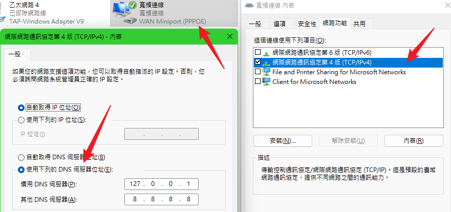

# go-dnsmasq 是一个轻量到只有 1.2MB 的DNS缓存/转发工具

https://github.com/soulteary/go-dnsmasq

https://soulteary.com/2021/08/19/dns-for-local-development.html


使用方法其实比上面还要简单，先来看配置文件：

127.0.0.1 lab.com
127.0.0.2 *.lab.com



## start ip local dns

```shell

docker run -d -p 53:53 -p 53:53/udp -v ${PWD}/hosts.conf:/hosts.conf:rw --name mydns yudady/go-dnsmasq   dnsmasq -l 0.0.0.0:53 -f /hosts.conf -p 1s --nameservers 168.95.192.1:53

# dns server
#        168.95.192.1
#        168.95.1.1
```


```shell
PS C:\Users\yu_da\Desktop> ping werwerwerwer.lab.com

Ping werwerwerwer.lab.com [127.0.0.2] (使用 32 位元組的資料):
回覆自 127.0.0.2: 位元組=32 時間<1ms TTL=128
回覆自 127.0.0.2: 位元組=32 時間<1ms TTL=128
回覆自 127.0.0.2: 位元組=32 時間<1ms TTL=128
回覆自 127.0.0.2: 位元組=32 時間<1ms TTL=128

127.0.0.2 的 Ping 統計資料:
    封包: 已傳送 = 4，已收到 = 4, 已遺失 = 0 (0% 遺失)，
大約的來回時間 (毫秒):
    最小值 = 0ms，最大值 = 0ms，平均 = 0ms
PS C:\Users\yu_da\Desktop> ping werwerwerwer.lab.com

Ping werwerwerwer.lab.com [185.53.177.53] (使用 32 位元組的資料):
回覆自 185.53.177.53: 位元組=32 時間=291ms TTL=43
回覆自 185.53.177.53: 位元組=32 時間=291ms TTL=43
回覆自 185.53.177.53: 位元組=32 時間=291ms TTL=43
回覆自 185.53.177.53: 位元組=32 時間=291ms TTL=43

185.53.177.53 的 Ping 統計資料:
    封包: 已傳送 = 4，已收到 = 4, 已遺失 = 0 (0% 遺失)，
大約的來回時間 (毫秒):
    最小值 = 291ms，最大值 = 291ms，平均 = 291ms
PS C:\Users\yu_da\Desktop>
```